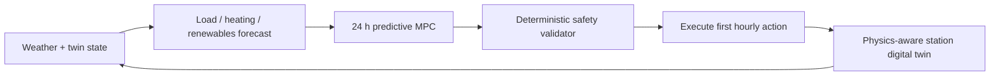

# POLAR-EMS

**Predictive Optimization & Load-Aware Renewable Energy Management System for Polar Research Stations.** POLAR-EMS is a runnable, synthetic-data prototype for an isolated 40-person polar microgrid. It models three diesel generators (600 kW total), 300 kW wind, 150 kW solar, a 1 MWh battery, thermal storage, prioritized loads, finite fuel, and severe weather.

Synthetic data is explicitly engineering-modelled test data, not Antarctic telemetry.

## Closed-loop architecture



The MPC predicts 24 hours, executes only its first action, then forecasts and optimizes again. The deterministic validator caps generator/battery commands, prohibits simultaneous battery charge/discharge, protects SOC and fuel reserves, and sheds non-critical demand before essential demand.

## Install

Python 3.11+ is required. From the repository parent:

```bash
cd /home/sohan/polar_ems-1
python -m venv .venv
source .venv/bin/activate
pip install -r polar_ems/requirements.txt
```

## Run a simulation

```bash
cd /home/sohan/polar_ems-1
python -m polar_ems.cli --scenario normal --hours 24
python -m polar_ems.cli --scenario storm --hours 48
python -m polar_ems.cli --scenario generator_failure --hours 48 --compare
```

Available scenarios: `normal`, `renewable_surplus`, `storm`, `extreme_cold`, `generator_failure`, `fuel_scarcity`, `wind_loss`, and `increased_demand`. Use `--baseline` for the reactive controller.

## Run the backend and dashboard

```bash
cd /home/sohan/polar_ems-1
uvicorn polar_ems.api.main:app --reload
streamlit run polar_ems/dashboard/app.py
```

The API provides `/health`, station/forecast endpoints, step/start/reset simulation endpoints, optimization plan, PERI risk, fuel autonomy, scenarios, sandboxed what-if simulation, and baseline comparison.

## Test

```bash
cd /home/sohan/polar_ems-1
pytest -q polar_ems/tests
```

## Incoming-storm example

In `storm`, the forecast flags reduced wind/solar and a temperature drop before arrival. The MPC raises its battery target, stores thermal energy, defers flexible work, and preserves battery discharge; after each hour it observes the twin’s new state and re-optimizes. `storm` and `generator_failure` are useful demonstration scenarios for comparing predictive control with the reactive baseline.

## Design notes

- `domain.py`, `digital_twin_v2.py`, and `station_config.py` contain physical state and configurable assumptions.
- `synthetic.py` is reproducible via seeds and correlates cold weather with heating and wind with wind power.
- `forecasting_engine.py` has modular fit/predict/evaluate/save/load interfaces. It uses explainable scenario-aware forecasts now and can be replaced by trained sklearn/XGBoost models.
- `mpc_engine.py` is a fast, dependency-free constrained candidate MPC suitable for this MVP. It exposes an optimizer boundary where Pyomo/HiGHS can be substituted without changing safety or simulation contracts.
- `risk_engine.py` calculates transparent 0–100 PERI contributions and dynamic fuel autonomy.
- `database/database.py` persists runs to SQLite and is intentionally repository-shaped for a PostgreSQL replacement.
